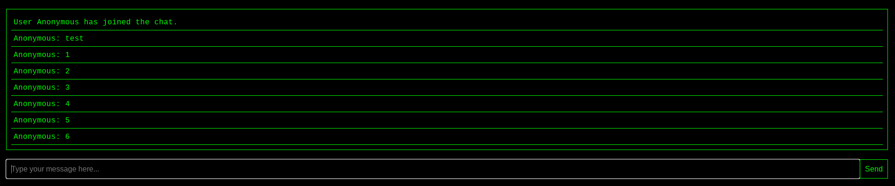

# NetBBS

NetBBS is a project to create a fully functional, old-style Bulletin Board System (BBS) from the 1990s.

To do this, the project utilizes Scaledrone for very fast and efficient communication.
